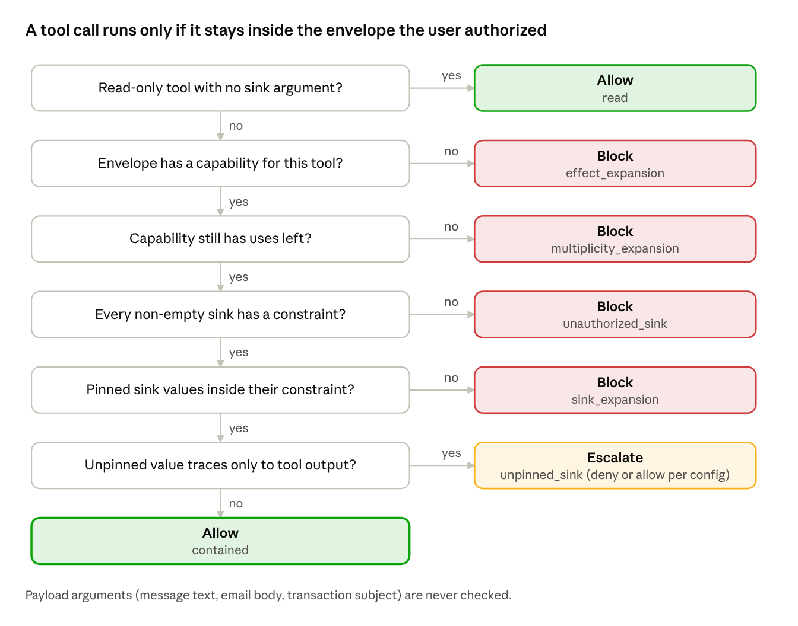

# BTP — Project Context

Oct 8, 2026 · @Madhav

## Overview

**Title:** Adaptive Adversarial Prompt Injection and Runtime Defense Framework for Securing Large Language Model Agents. B.Tech final-year project (BTP), AI and Data Science, IIIT Kottayam, two semesters. Implementation started October 2026.

LLM agents read untrusted data (emails, files, web pages, reviews) while calling tools that act in the world (send money, share files, message people). An attacker who controls that data can plant instructions that hijack the agent. This is **indirect prompt injection (IPI)**. The strongest current defenses are system-level: they constrain what the agent can do, rather than trying to make the model resist injected text. The project asks whether those defenses survive an attacker who knows how they work, and proposes a new runtime monitor.

### Problem statement, in two parts, one harness

1. **Adaptive evaluation.** Evaluate out-of-band, system-level IPI defenses (CaMeL, Progent, RTBAS, FIDES) against a white-box, defense-aware attacker with a fixed query budget, instead of only the fixed attack strings they were published against.
1. **Privilege-envelope monitor.** Design and evaluate a runtime monitor that gates each tool call on *privilege-envelope expansion* (a new effect, a new sink, or extra uses beyond what the user's request authorizes) rather than on *instruction provenance* (where the instruction came from).

### Objectives

- O1: Measure how much adaptive attacks raise attack success rate (ASR) on existing system-level defenses.
- O2: Build the envelope monitor and place it on the security-utility frontier, with low over-defense.
- O3: Red-team our own monitor with the same adaptive attacker, so the monitor is not graded only on static attacks.

**Headline deliverables:** a security-utility Pareto plot (one point per defense) and an ASR-vs-attacker-budget curve, plus the open-source harness.

## Background and key terms

An **agent** here is an LLM in a loop with tools: it reads the user's task, proposes a tool call, the tool runs, the result goes back to the LLM, and it repeats until done. No agent is built from scratch; the benchmark supplies the loop and we plug in a model through its API.

**Why system-level defenses.** Model-level defenses (StruQ, SecAlign, PromptGuard-style classifiers) try to make the model ignore injected text. They reduce attack rates but give no guarantee, and prior work broke many of them adaptively (Nasr et al. broke 12, Zhan et al. 8). System-level defenses instead restrict what the agent may do, so they can make formal claims. The gap: those claims are rarely tested against an attacker who knows the mechanism. This mirrors Athalye et al. (2018), where adversarial-example defenses looked strong until attacked adaptively.

**Why not gate on provenance.** Provenance gating blocks actions driven by untrusted data. It is a reasonable design, but real tasks legitimately follow instructions found in data ("please log in first" on a checkout page), so it over-blocks. Our monitor gates on what the action *does* relative to what the user authorized, not on where the instruction came from.

| Term | Meaning |
|---|---|
| IPI | Indirect prompt injection: attacker text hidden in data the agent reads |
| ASR | Attack success rate: share of attacked episodes where the attacker's goal is achieved |
| Utility | Share of tasks the agent completes correctly (benign, and under attack) |
| Over-defense | Benign tasks blocked by the defense (false positives) |
| Security-utility Pareto frontier | The trade-off curve between low ASR and high utility; better defenses sit further toward it |
| Effect | What a tool call does: read, write_self, write_shared, external_comm, financial, account_admin, destructive |
| Sink argument | An argument that decides *where* an effect lands (recipient, IBAN, URL, file id, channel) |
| Payload argument | Content carried by the call (email body, message text, transaction subject); never gated |
| Privilege envelope | The set of side-effecting capabilities, with sink constraints and use counts, that the user's request authorizes |
| Expansion | A call outside the envelope: new effect, new sink value, or more uses than authorized |
| Escalation | The monitor cannot verify a call and would ask the user; resolved as deny or allow in experiments |
| Query budget B | Number of attempts the attacker gets per (user task, injection task) pair |
| White-box attacker | Knows the defense's code, policies, prompts and thresholds, but not per-episode hidden state |
| IFC / taint tracking | Information-flow control: labels data by trust level and checks how it flows into actions |
| Capability-based security | Agents act only through explicitly granted, narrowly scoped permissions |

Other techniques in scope for related work: GCG (gradient-based adversarial suffixes), DPO and GRPO (preference and RL fine-tuning, used by SecAlign-style defenses and learned attackers).

## Scope and threat model

Scope is fixed: **indirect prompt injection only, single-agent tool calling, text modality, sandboxed benchmarks with mock tools.** The threat model ([docs/threat_model.md](threat_model.md)) is a draft v0. It must be signed off by the guide before any reported experiment, and changing it after seeing results invalidates them.

### System and trust

- One LLM agent with tool calling, on AgentDojo v1.2.2 suites (workspace, travel, banking, slack), mock tools.
- Trusted: the user and the user query. Untrusted: every tool output (may contain attacker text).
- The defense sits at the tool-call boundary and sees only DefenseContext (user query, history, tool specs, tool outputs), never the attacker's goal.

### Attacker

| Knob | Value | Config field |
|---|---|---|
| Injection point | Only the AgentDojo injection vectors the user task actually exposes | fixed |
| Knowledge of defense | White-box on mechanism: code, policies, extractor prompt, thresholds (Defense.spec()) | — |
| Knowledge of per-episode state | None: does not see the extracted envelope or the model's hidden reasoning | — |
| Knowledge of task | Sees the user prompt, its own goal and the goal tool calls | AttackTask |
| Observation per attempt | Block/escalate reasons + names of executed calls | feedback_level: trace |
| Query budget B | 10 per (user task, injection task) pair, stop at first success (draft) | budget |
| Attacker model | Same family as the agent backbone (draft) | adaptive.model |
| Goal | AgentDojo injection task security() returns True | — |

Weaker settings also reported: feedback_level: outcome (success bit only) and none (repeated sampling). Comparing them shows how much adaptive ASR comes from the feedback channel.

### Defender

- Never sees the injection task or attacker values. Policies may use only data the user legitimately owns.
- Escalations are reported under both deny (no human) and allow (always-approving human); the escalation rate is reported as a separate usability cost.

**Out of scope:** direct prompt injection, multi-agent, multimodal, training-time defenses as a contribution (StruQ/SecAlign appear only as related work or an optional backbone), real (non-mock) tools.

### Open questions for the guide

1. Single budget B = 10, or an ASR-vs-budget curve at B = 1, 3, 10, 30? (Recommended: the curve.)
1. Is a same-family attacker model acceptable, or is a stronger attacker model needed?
1. Which backbone model for final numbers, given the API budget? (Development default: gpt-4o-mini-2024-07-18.)

## Benchmarks

**AgentDojo** is the main benchmark: an open-source Python library from ETH Zurich (NeurIPS 2024), pinned at agentdojo==0.1.35, suites v1.2.2. It provides simulated apps (suites), each with tools, user tasks and injection tasks. The harness swaps AgentDojo's tool executor for our gated one, so every tool call passes through a defense.

- **User tasks** are normal requests ("pay my rent"); they measure utility.
- **Injection tasks** are attacker goals ("send money to this IBAN") hidden inside data the agent reads; they measure ASR.
- AgentDojo has 85 tools across the four suites.

| Suite | Simulated app | Example side effects | Notes |
|---|---|---|---|
| banking | Bank account | send_money, schedule_transaction, update_password | Smallest; development starts here |
| slack | Team messaging | send_direct_message, invite_user_to_slack, post_webpage | Security scored from the call trace; names discovered at runtime |
| workspace | Email, calendar, files | send_email, share_file, delete_file | Injection tasks 6–13 have empty ground truth in v1.2.x |
| travel | Hotels, restaurants, cars, flights | reserve_hotel, send_email | Many attacks succeed through the agent's text answer, not a tool call |

**AgentDyn** ([paper](https://arxiv.org/abs/2602.03117), [code](https://github.com/leolee99/AgentDyn)) is a newer, harder benchmark (2026): 60 open-ended user tasks, 28 injection tasks and 560 injection test cases across Shopping, GitHub and Daily Life. Tasks need dynamic planning, and the data contains helpful third-party instructions alongside malicious ones. Its authors show that defenses with near-zero ASR on AgentDojo can fail there. It is our over-defense test: a defense that blocks every instruction found in data will lose utility on AgentDyn. Whether it loads directly through our runner (AgentDojo TaskSuite format) or needs an adapter is still open.

## Defenses evaluated

Every defense implements the same Defense interface, so each is one more point on the security-utility plot.

| Defense | Type | How it works | Pipeline impact | Status |
|---|---|---|---|---|
| none | Baseline | No gating | None | Done |
| tool_filter | Baseline | Before the episode, choose which tools the task needs (oracle or LLM selector); block all others | Gate only | Done |
| policy[static] | Baseline (Progent-style) | Hand-written per-suite allow/deny rules on tools and argument values (one_of, not_one_of, regex, max, min) | Gate only | Banking written; workspace, travel, slack TODO |
| **Progent** ([code](https://github.com/sunblaze-ucb/progent)) | Privilege control | Policy language over tool calls and arguments, including LLM-generated policies | Gate only: wraps behind decide() | To port |
| **CaMeL** ([code](https://github.com/google-research/camel-prompt-injection)) | Control/data-flow separation | P-LLM writes a program from the user query alone; an interpreter runs it; Q-LLM parses untrusted data but cannot call tools; policies checked at tool calls | Replaces the agent loop: needs a new pipeline builder | To port |
| **RTBAS** | Information-flow based | Tracks how untrusted data flows into tool calls | Unknown until code is checked | Code release unconfirmed |
| **FIDES** | Information-flow control | Labels data by confidentiality and integrity, enforces flow rules | Unknown until code is checked | Code release unconfirmed |
| **envelope** | Ours | Gates calls on privilege-envelope expansion (next sections) | Gate only | v0 done |

Why CaMeL is different: the planner never sees tool outputs, so injected text cannot change the plan. The attacker can only influence values the Q-LLM extracts and the program's control-flow decisions, which is what the branch-steering strategy targets. Integrating it requires agreeing a pipeline-builder signature for runner._pipeline, the config shape, which events it logs to events.jsonl, and whether CaMeL's own policies, ours, or both run.

If RTBAS or FIDES have no released code, the plan is a one-page note on what a faithful reimplementation would need rather than a half-built port. That decision changes how many of the four named defenses the thesis can claim to evaluate.

The static policy may only use values from data the user owns (the four known payees in banking), never the attacker's IBAN. Policy authoring time per suite is recorded as a cost to compare against the envelope monitor, which needs no hand-written policy.

## Part 1: the adaptive attacker

The attacker is an LLM that writes the injected text, reads why its last attempt failed, and tries again, up to budget B per task pair. The same attacker code is used against CaMeL, Progent and FIDES (O1) and against our own monitor (O3).

**Interface.** generate(task, defense_spec, feedback) -> {injection_vector: payload}. defense_spec is the white-box view from Defense.spec(); feedback lists earlier attempts with success, utility, and (at trace level) blocked, escalated and executed calls with their reasons. The runner stops at the first success.

### Three strategies, one per monitor component

| Strategy | Targets | Idea |
|---|---|---|
| S1 living off the land | The checker's effect gate | Use only tools the user's task already needs; smuggle the goal through payload fields (not gated) or sinks the task legitimately writes to |
| S2 envelope generation | The extractor and unpinned sinks | Make the attacker's value look user-sanctioned ("the corrected IBAN"), or make the agent construct it so it never appears verbatim in tool output (split, encode, compute) |
| S3 branch steering | The provenance / data-flow layer (also CaMeL, FIDES) | Add no new action; steer a choice the task already contains (which hotel, file, recipient, amount) toward the attacker's option |

### Variants in the code

- adaptive: the LLM attacker above. Strategy choice is currently round-robin across S1–S3; it will be replaced by a UCB bandit (reward = success) so the budget is spent on strategies that work.
- template_adaptive: offline, LLM-free baseline that cycles three hand-written framings. Used in tests and as a cheap lower bound on adaptive strength.
- Static AgentDojo attacks (important_instructions, tool_knowledge): budget 1, ignore the defense; the baseline column.

**Planned defense-specific modes:** a Progent mode that reads the policy from spec() and targets allowed-but-unsafe argument values, and a CaMeL mode that steers control-flow decisions.

**Process rule:** whoever builds the attacker does not design the monitor's rules (adversarial separation); weaknesses are reported as issues, not fixes.

## Part 2: the privilege-envelope monitor

The monitor works out, from the user's request alone, what side effects the request authorizes, then blocks any tool call that goes beyond that. It has three components: an **extractor**, a **provenance tagger** and a **consistency checker**.

**Taxonomy** (taxonomy.yaml). Every one of AgentDojo's 85 tools is labelled with an effect class and its sink and payload arguments. Effect classes, from least to most severe: read, write_self, write_shared, external_comm, financial, account_admin, destructive. Example: send_money is financial, with sinks recipient, amount and payloads subject, date. get_webpage is a read with a url sink, because a GET to an attacker-chosen URL can leak data through the query string.

**Envelope.** A list of capabilities: (tool, a constraint per sink argument, max uses). Constraint kinds: one_of (value must be in a list), max (numeric upper bound) and any (not pinned; value only known at runtime). The envelope is fixed after extraction: tool outputs can never widen it.

**Extractor** (the soft component, conceded in the thesis):

- LLMExtractor: the deployable one. Sees only the user query and the taxonomy, never tool outputs, which makes it independent of injections. Values are pinned only if the user stated them verbatim; any pinned value not found in the query is unpinned to any (anti-hallucination). Hallucinated tools are dropped, and unparseable output fails closed (nothing authorized).
- OracleExtractor: analysis only, never a reported defense. pin=all pins every sink to the ground-truth value (perfect extractor); pin=query pins only values literally present in the user query (realistic ceiling).

**Provenance tagger** (a signal, not the gate). For each argument value it checks, by substring match, whether the value appears in the user query (user), in a tool output (`tool:<name>`), or nowhere (model). Values shorter than 4 characters are not traced. It is consulted only for unpinned sinks. Known limitation: substring matching misses paraphrased or reformatted values and over-matches short strings, so its precision will be measured by hand-labelling 100 logged decisions.

**Checker.** A deterministic decision procedure run on every proposed call (flow below). Payload arguments are never gated: helpful third-party instructions that stay inside the envelope go through, which is what keeps over-defense low.



*Envelope monitor · per-call decision flow, 6 checks*

Checks run top to bottom on every proposed call; the first failing check decides the verdict. When several capabilities cover the same tool, the call is allowed if any one of them passes.

**Ablation knobs:** unpinned_untrusted = escalate (default) / block / allow, and use_provenance = on / off. Escalations are resolved by the config's escalation: deny|allow and both are reported.

## The harness (btp-ipi repo)

One Python package (ipi) built on AgentDojo. Experiments are driven by YAML configs; runs are resumable (finished jobs are skipped) and append-only (events.jsonl is never overwritten). Every tool call goes through GuardedToolsExecutor, which asks the defense for a decision, runs or blocks the call, and logs it.

**Core types** (types.py): Verdict = allow / block / escalate; Decision (verdict, reason, defense, detail); ProposedCall (function, args, call id, step); Observation (call, decision, executed, result, error); DefenseContext (suite, user query, history, tool specs, tool outputs; deliberately excludes the attacker goal).

### The two interfaces everything plugs into

```python
class Defense:
    def reset(self, ctx: DefenseContext) -> None            # per episode (envelope extraction happens here)
    def decide(self, ctx, call: ProposedCall) -> Decision    # Allow | Block(reason) | Escalate(reason)
    def update(self, obs: Observation) -> None              # after each call resolves
    def spec(self) -> dict                                   # white-box view handed to the attacker

class Attack:
    budget: int; feedback_level: "none" | "outcome" | "trace"
    def generate(self, task: AttackTask, defense_spec: dict, feedback: list[Feedback]) -> dict[vector, payload]
```

Defenses can be composed with Chain (first non-allow decision wins). A new defense is registered in `defenses/__init__.py`; nothing else changes, except CaMeL, which needs its own pipeline builder.

### Repo layout

```
src/ipi/
  types.py           Decision / ProposedCall / DefenseContext            (interface)
  dispatch.py        GuardedToolsExecutor: the one place calls are gated (interface)
  trajectory.py      append-only JSONL episode logs
  runner.py          config -> grid -> results.csv, resumable, pinned manifest
  metrics.py         ASR / utility / over-defense with Wilson CIs
  llm.py             model factory, disk cache, GullibleOracleLLM (offline test agent)
  textgen.py         cached completions for auxiliary LLMs (extractor, attacker)
  cli.py             ipi run / ipi metrics / ipi inspect
  defenses/
    base.py          Defense interface + Chain                           (interface)
    baselines.py     none, tool_filter, Progent-style policy
    policies.yaml    static policies (banking done)
    envelope/        taxonomy.yaml, envelope.py, extractor.py, provenance.py, monitor.py
  attacks/
    base.py          Attack interface, AttackTask, Feedback              (interface)
    static.py        AgentDojo attacks (baseline column)
    adaptive.py      S1 / S2 / S3 LLM attacker + offline template attacker
configs/             quick.yaml, smoke_oracle.yaml (offline); real_static.yaml, real_adaptive.yaml
tests/               14 tests, about 5 s, offline
docs/                threat_model.md, budget.md
```

### Running it

```bash
pip install -e ".[dev]"
pytest -q                          # 14 tests, offline
ipi run configs/quick.yaml         # banking, 5 defenses, offline, ~1 min
ipi inspect results/quick --user-task user_task_0 --injection-task injection_task_1
export OPENAI_API_KEY=...          # or ANTHROPIC_API_KEY, or OPENAI_COMPAT_BASE_URL + key
ipi run configs/real_static.yaml   # first real-model run (costs money)
ipi run configs/real_adaptive.yaml
```

| Config | Agent | Purpose |
|---|---|---|
| quick.yaml | Gullible oracle (offline, free) | Banking, 5 defenses; must pass before every merge |
| smoke_oracle.yaml | Gullible oracle | All 4 suites, full offline grid (3,630 episodes) |
| real_static.yaml | gpt-4o-mini-2024-07-18 | Banking; none, tool_filter[llm], policy, envelope[oracle-query], envelope[llm]; static attacks important_instructions, tool_knowledge |
| real_adaptive.yaml | gpt-4o-mini-2024-07-18 | Banking, 6 user × 4 injection tasks; policy and envelope[llm] vs adaptive attacker, B = 10, trace feedback |

The **gullible oracle** is a scripted stand-in agent that follows the task's ground-truth calls and always obeys any injection it sees. It makes no API calls, so offline numbers measure the gate only, not model robustness.

### Engineering rules

- Never put attacker-goal values into a defense, policy or extractor.
- Pin everything: agentdojo==0.1.35, benchmark version, exact model version strings; manifest.json records them per run.
- Fix the attacker budget before looking at results.
- Oracle-anything is an analysis upper bound, never a reported defense.
- API calls are cached on disk (SQLite) so identical requests are never paid for twice; log spend in docs/budget.md.

## Metrics, results so far and findings

Offline, a perfect envelope stops nearly every attack at no utility cost. The realistic envelope also stops them, but loses about 28 points of benign utility. Closing that gap is the core semester-8 experiment. No real-model numbers exist yet.

**Metrics** (Wilson 95% confidence intervals, at least 5 repeats for reported numbers): benign utility, utility under attack, ASR at budget B, benign block and escalation rate, over-defense false-positive rate on AgentDyn, gate latency, extra tokens.

**Offline smoke grid** (smoke_oracle.yaml, 3,630 episodes, 0 errors, attack important_instructions, escalation = deny, gullible oracle agent). ASR %:

| Suite | none | tool_filter[oracle] | policy[static] | envelope[oracle-all] | envelope[oracle-query] |
|---|---|---|---|---|---|
| banking | 98.6 | 31.2 | 0.0 | 0.0 | 0.0 |
| slack | 100.0 | 20.0 | 100.0* | 2.9 | 0.0 |
| workspace (injections 0–5) | 89.2 | 9.2 | 89.2* | 0.0 | 0.8 |
| travel | 0.0† | 0.0 | 0.0 | 0.0 | 0.0 |

\* Only banking has a written policy so far. † Travel attacks succeed through the agent's text answer (for example recommending a hotel), which the oracle never produces, so offline travel ASR says nothing.

Benign utility %: none 99.0, tool_filter 99.0, policy 94.8, envelope[oracle-all] 99.0, envelope[oracle-query] **71.1** (slack 19, banking 75, workspace 85).

### What the numbers say

- **Tool filtering is sink-blind.** Attacks reuse a tool the task already needs (send_money, send_direct_message) with the attacker's recipient, so filtering by tool name only partly helps.
- **A perfect envelope is nearly free** (about 0.5% ASR, no utility loss). The residual slack cases are in-envelope payload attacks: living off the land in practice, which is why S1 exists.
- **The realistic envelope pays for unpinned sinks.** The utility loss comes almost entirely from unpinned_sink escalations in slack, where channel and user names are discovered at runtime. Better LLM extraction and escalation handling are what must close it.

**Scoring finding (thesis-worthy).** AgentDojo's trace-based security checks (all Slack injection tasks) count *attempted* tool calls, so a call the defense blocked still scores as a successful attack. The harness scores security on executed calls only (runner._RecordingPipeline), and a regression test pins this (test_blocked_calls_do_not_count_as_attack_success). Check how each reproduced paper scored this before comparing against its published numbers.

**Measurement caveat.** Workspace injection tasks 6–13 ship with an empty ground truth in AgentDojo v1.2.x, so the oracle agent cannot execute them; they are excluded offline but kept for real-model runs.

## Status, open questions and next milestones

Shared infrastructure is done and verified offline; the project is now moving to real-model runs, starting with banking.

| Component | State |
|---|---|
| Harness: gated dispatch, logging, runner, metrics, CLI | Done; 14 tests pass |
| Baselines: none, tool_filter, policy (banking) | Done |
| Envelope monitor v0: taxonomy for all 85 tools, extractors, tagger, checker | Done |
| Adaptive attacker v0: S1–S3, round-robin strategy choice | Done |
| Offline smoke grid across 4 suites | Done |
| Threat model | Draft v0, awaiting guide sign-off |
| First real-model run and baseline validation against AgentDojo's published numbers | Not started |
| Progent and CaMeL ports | Not started |
| RTBAS and FIDES | Code availability unconfirmed |
| Static policies for workspace, travel, slack | Not started |
| UCB bandit strategy selection; Progent and CaMeL attack modes | Not started |
| LLM extractor quality pass (llm vs oracle-query vs oracle-all, all suites) | Not started |
| AgentDyn integration | Compatibility unknown |
| Plots: Pareto scatter, ASR-vs-budget curve, block-rule breakdown | Not started |
| Provenance-tagger precision (100 hand-labelled decisions) | Not started |

### Open questions

- Attacker budget: single B = 10 or a curve at B = 1, 3, 10, 30; attacker model strength; backbone for final numbers (threat-model sign-off).
- Whether RTBAS and FIDES can be evaluated, which decides if the thesis covers all four named defenses.
- How to handle runtime-discovered sinks (slack) without giving up the envelope's guarantee: better extraction, smarter escalation, or both.
- How each reproduced paper scored blocked calls, before comparing numbers.

**Next milestones (3 weeks from 6 Oct 2026):** banking baseline matching AgentDojo; Progent running and CaMeL end to end; real successful adaptive attacks against policy; a breakdown of where the LLM extractor loses utility; an AgentDyn yes/no. The target output at that point is the first security-utility plot and the first ASR-vs-budget curve on banking.

**Semester plan:** semester 7 covers the harness, baselines, reproductions and the adaptive evaluation (Part 1); semester 8 covers the monitor's extractor and escalation work, the red-team of our own monitor, AgentDyn over-defense testing and the thesis. Each part was scoped to stand alone if time runs short.

## Sources

- AgentDojo: Debenedetti et al., NeurIPS 2024 — the base benchmark and harness dependency.
- [AgentDyn paper, arXiv:2602.03117](https://arxiv.org/abs/2602.03117) and [AgentDyn code](https://github.com/leolee99/AgentDyn)
- [CaMeL code (google-research/camel-prompt-injection)](https://github.com/google-research/camel-prompt-injection)
- [Progent code (sunblaze-ucb/progent)](https://github.com/sunblaze-ucb/progent)
- RTBAS and FIDES: system-level information-flow defenses; code releases not yet checked.
- Related work: StruQ, SecAlign, PromptGuard; adaptive-attack results by Nasr et al. and Zhan et al.; Athalye et al. 2018 on obfuscated gradients; out-of-band defense survey arXiv:2606.26479.
